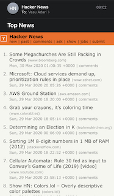

# Hacker News Alert


Everyday at 9 AM, 3 PM and 9 PM sends email alert for Hacker News. Uses github cron to schedule this alert.

**Email Preview**



# Usage

```
mix hacker_news_alert
```

# How to Subscribe?

Add an entry to `priv/static/subscribers.txt` and raise a pull request to get email alerts.
